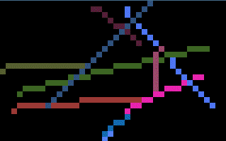

rasterizer
==========

An experiment in software rendering, using Go and SDL2.

Screen recording
----------------

General info
------------

* Version: 0.1
* Author: Alexander F. Rødseth &lt;xyproto@archlinux.org&gt;
* License: GPL2
